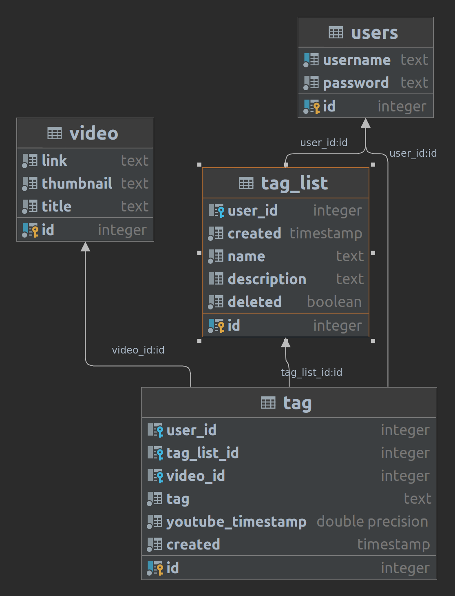
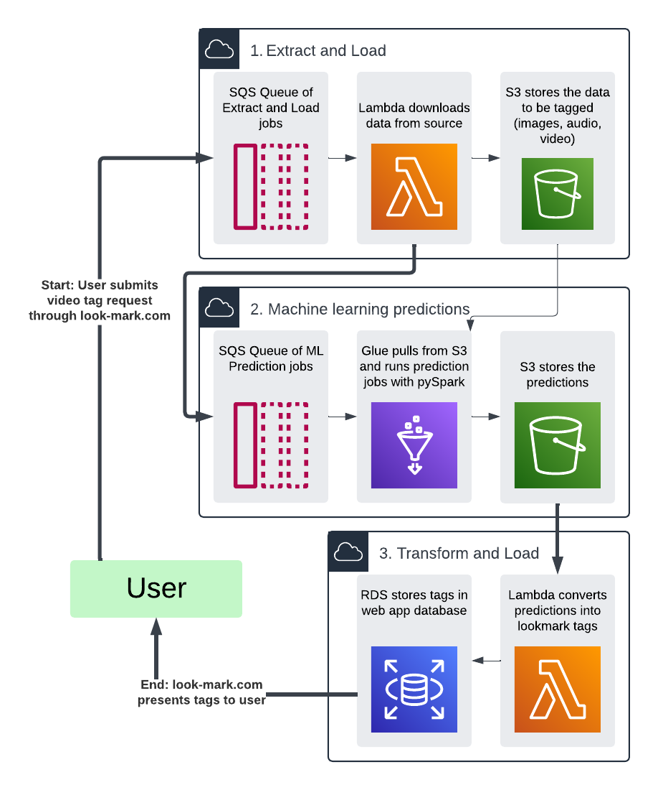

# Video Bookmarks
Tag videos at specific timestamps for easy reference

## Quickstart Pre-Reqs

 - clone the repository locally
 - in the `videobookmarks` directory, 
do`python3 -m pip install .` for setup
 - export a DB_URL environment variable,
use a value with the suffix `_test` to run unit tests
 - export a YouTube API key environment as `YT_API_KEY`. Note that if the API Key has not been shared with you, 
you will need to generate one.

 Use Makefile commands below to run install dependencies and unit tests.

--------------

# Makefile Commands
#### this might not be currently working as of 01-25-2024
<i>command line Makefile statements are formatted as: `make <command>` </i>
```commandline
venv      - set up virtual environment (Optional)
install   - Install dependencies
test      - Run unit tests
clean     - Clean up compiled Python files and __pycache__
help      - Display this help message
```


### Schema


`user` Contains the encrypted login credentials for users.

| field    | meaning                   |
|----------|---------------------------|
| username | plain text/human readable |
| password | encrypted                 |

`tag_list` 
A tag list is a collection of related tags.
One user can create one or more tag lists. 
Each tag list is associated with only one user.

| field       | meaning                                                                                                                                                                                         |
|-------------|-------------------------------------------------------------------------------------------------------------------------------------------------------------------------------------------------|
| created     | timestamp to track when it was created                                                                                                                                                          |
| name        | name of the tag list itself. arbitrary, user defined.                                                                                                                                           |
| description | optional: description of what the tag list is tracking                                                                                                                                          |
| deleted     | boolean: true if the tag list has been deleted by the user. <br/>If true, the tag list will not show up in the app. It is kept in the database in case the original author wants to restore it. |

`video` 
a video must be added to the database in order for tags to be added to it. 
This is done automatically when the first tag is added to a video in the app.
We store some extra data here so that we don't have to continuously make calls to the youtube
API as users are navigating the app.

| field     | meaning                                           |
|-----------|---------------------------------------------------|
| link      | text: the youtube video id                        |
| thumbnail | text: a link to the youtube hosted thumbnail image |
| title     | the title of the video                            |

`tag` 
Once a tag list has been created, a user can add tags to it. 
A tag list can contain multiple tags, but a tag can only
belong to 1 tag list. A video can be linked to multiple tags, but a tag can only be linked to 1 video.

| field             | meaning                                                                                                                                                                                                                        |
|-------------------|--------------------------------------------------------------------------------------------------------------------------------------------------------------------------------------------------------------------------------|
| tag               | the label of the tag. Arbitrary, user defined. <br/>eg. in a youtube video of a nature documentary, a user might tag a specific timestamp with the tag "bird" to signify a  point in the video when a  bird appears on screen. |
| youtube_timestamp | integer: the time in seconds when the tag occurs in the video                                                                                                                                                                  |
| created           | timestamp to track when it was created                                                                                                                                                                       |

## ML Automated Tagging Pipeline

WIP This ML pipeline wll enable the user to submit a request for a video to be automatically tagged with ML. 

Todo:
- design emotion detection algorithm (proof of concept)
- set up ML prediction transformation lambda that sends to look-mark
- set up emotion detection algorithm in glue with pyspark
- set up data extraction lambda (youtube video downloader)
- set up api endpoint that sends to sqs queue


